

<h1> 🏠  Sweet Home</h1>
<h3> 아파트 정보 조회! </h3>

 

 

## 📝 프로젝트 소개

SSAFY BackEnd 관통 프로젝트

- 주제: 부동산

<h2> 개발 기간 </h2>

- 23.03.27(월) ~ 23.03.31(금)

<h2> 참여 인원 </h2>

1조

- 우수인
- 임규돈
- 이상욱

## ERD
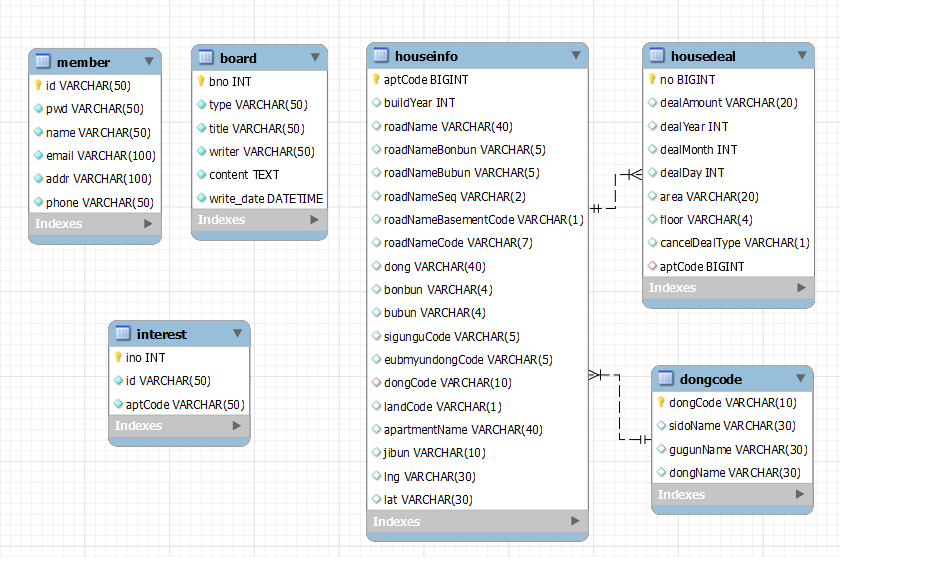</img>
 
- MySql ERD
- Table끼리 Join 하여 DAO에 활용하였음

## 💻 주요기능

<h2> 메인 화면 </h2>

 

- 로그인 전/후 메인화면

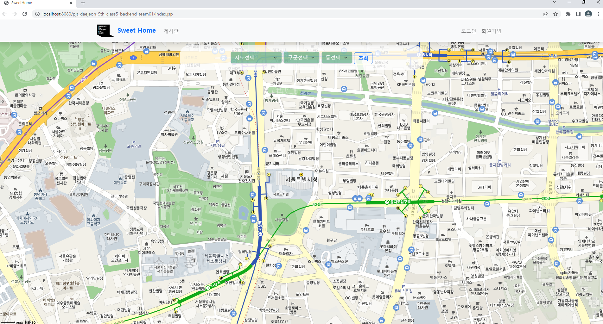</img>
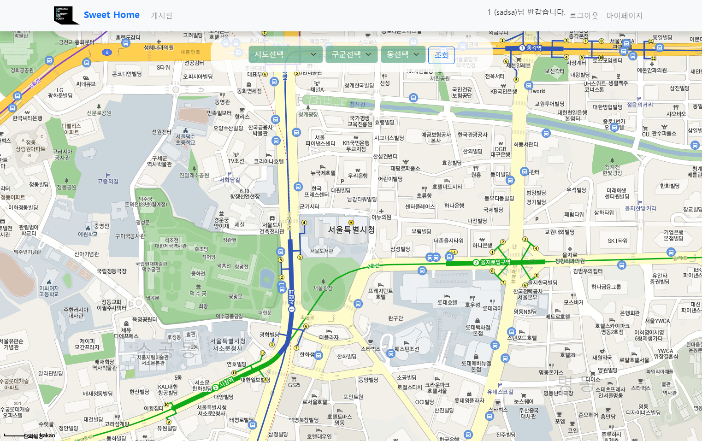</img>

<h2> 검색 및 마커 Info </h2>

- 검색 시 지도에 마커 표시
- 마커 클릭 시 매물 Info 창 띄움
- Info창에 매물에대한 기본 정보 및 주변상권확인, 찜하기 기능 추가
- DB에 저장된 데이터 사용

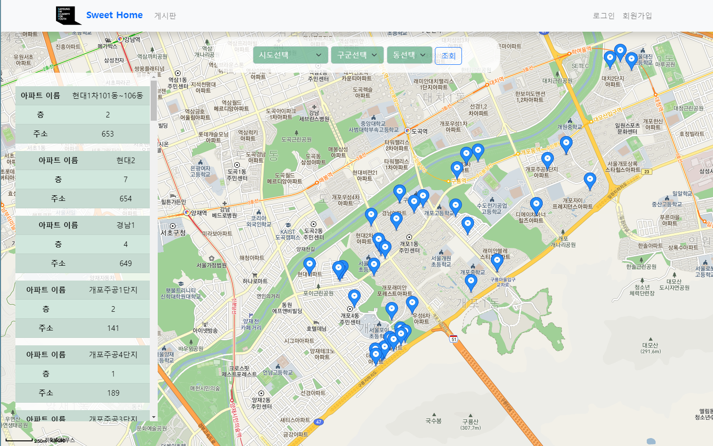</img>
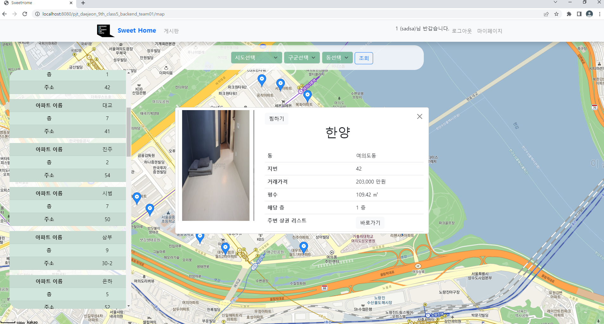</img>

<h2> 찜한 매물 리스트 </h2>

- Info창에서 찜하기 누르면 로그인 되어있을 경우 찜 목록에 추가
- 마이페이지에서 찜목록 확인 가능
- 찜하게되면 DB에 저장

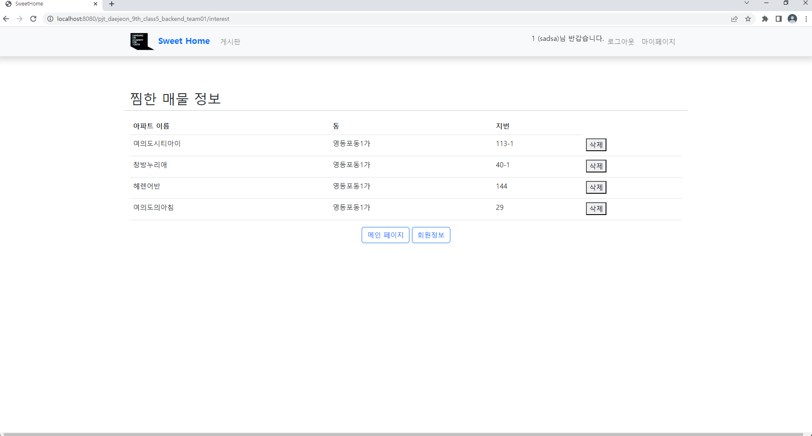</img>

<h2> 주변 상권 조회 </h2>

- 매물 Info창에서 주변 상권 보기 클릭 시 상권 리스트 나옴 
- 해당 좌표 기준 일정 범위까지 상권 조회  

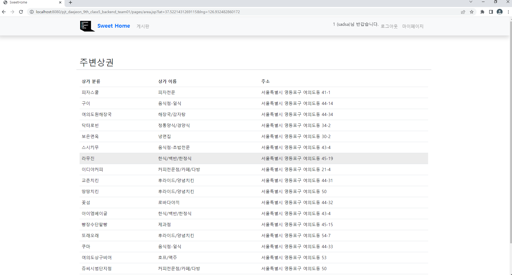</img>

<h2> 로그인 </h2>

- 세션에 로그인 정보 저장하여 헤더 변경
- 로그인 상태인 경우 마이페이지와 로그아웃 버튼 구현
- 로그아웃 상태인 경우 로그인과 회원가입 버튼 구현

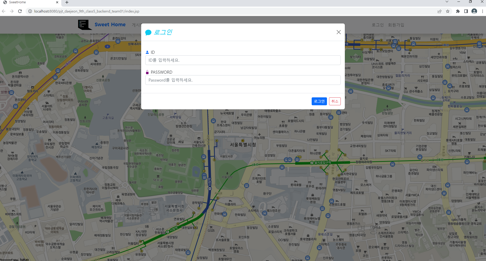</img>

<h2> 회원가입 </h2>

- 회원에 대한 정보를 입력받는 창(Modal)을 띄워 정보 입력
- ID, PWD, 이름, 이메일, 주소, 전화번호를 입력

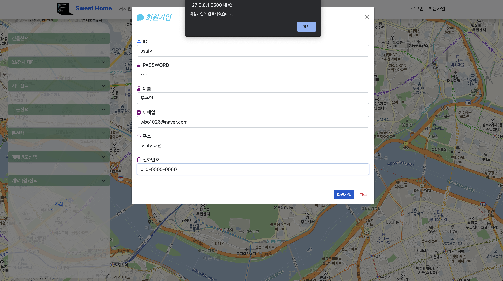</img>

<h2> 마이페이지 </h2>

- 세션에 저장된 로그인 아이디로 회원 정보를 가져옴
- 회원 정보를 수정할 수 있는 화면 구현

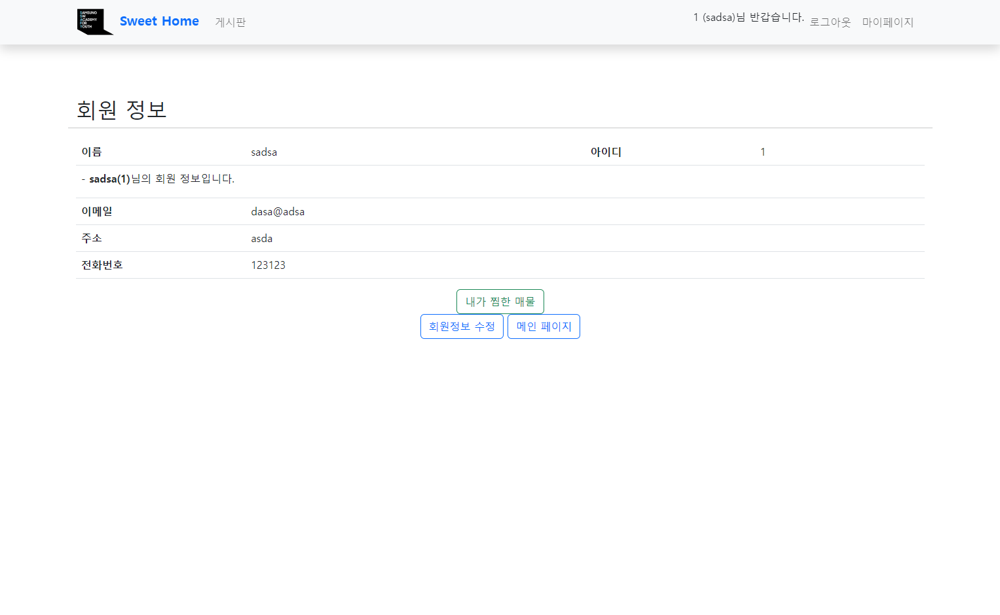</img>
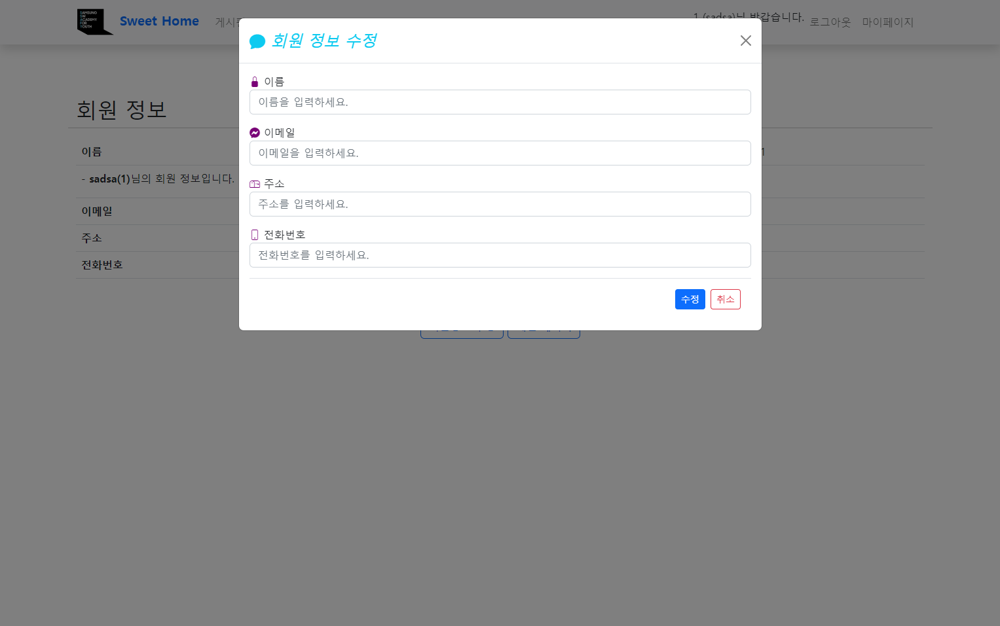</img>

<h2> 게시판 </h2>

- 유저들이 글을 쓸 수 있는 게시판 구현
- 로그인을 한 상태에는 글 쓰기 버튼이 보여 글을 쓸 수 있음 (비 로그인 시 글 쓰기 불가능)
- 관리자로 로그인 할 시 공지사항 작성 가능
- 일반 유저는 공지사항 출력 불가
- 공지사항은 최신 3개 출력
- 문의사항은 5개씩 페이지 구현
- 검색 기능 추가

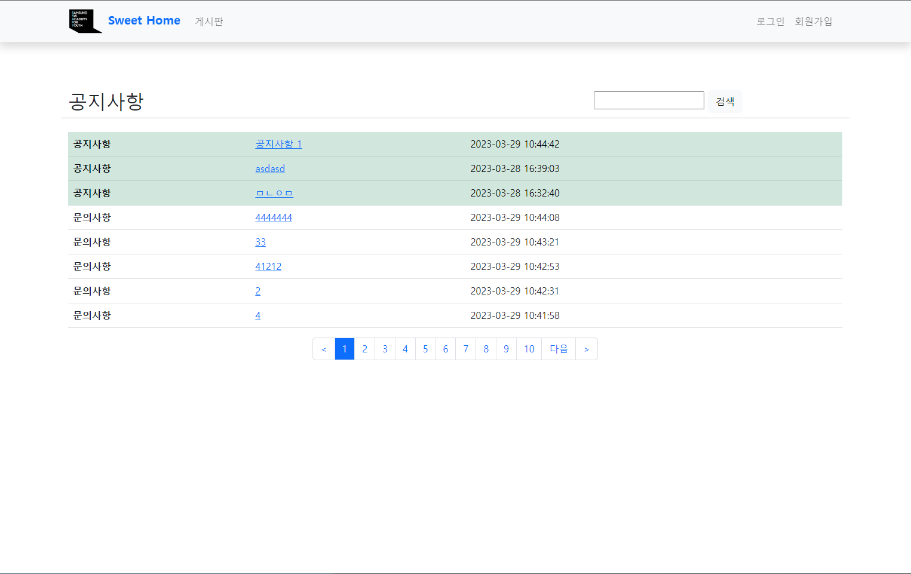</img>
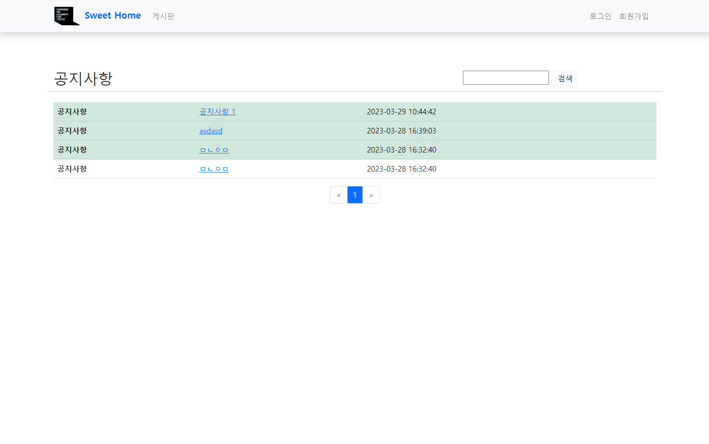</img>

